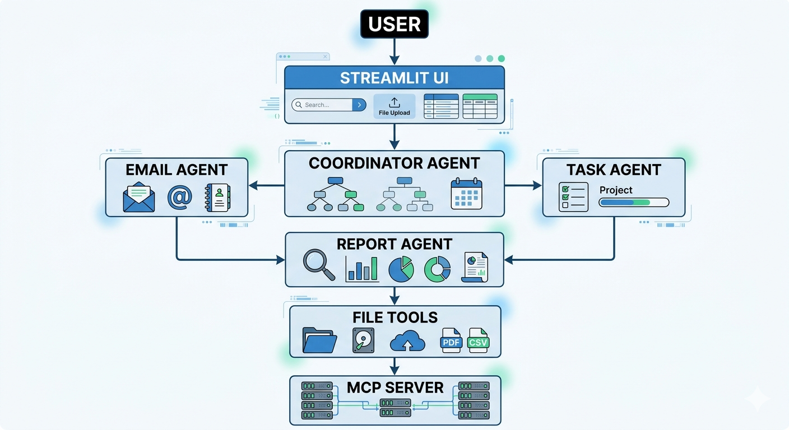
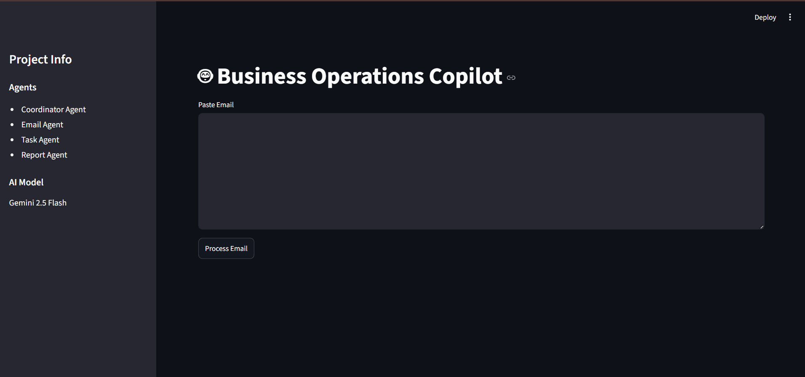
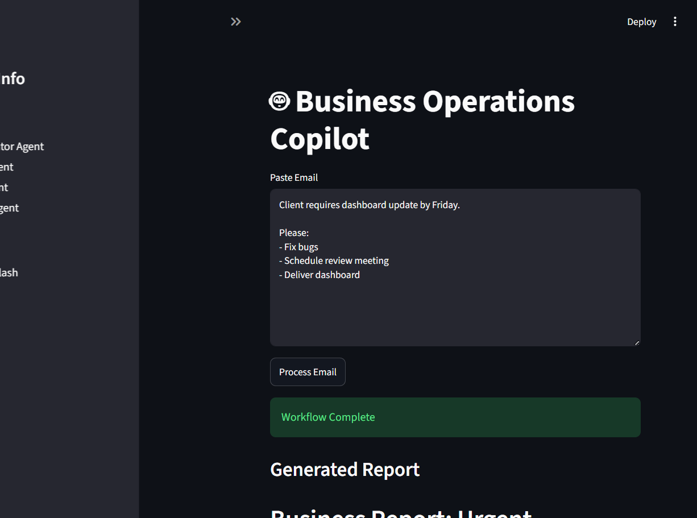

# Business Operations Multi-Agent Copilot

## Overview

A multi-agent AI system that automates:

- Email analysis
- Task extraction
- Task prioritization
- Report generation

## Architecture

User
 ↓
Coordinator Agent
 ↓
Email Agent
 ↓
Task Agent
 ↓
Report Agent
 ↓
MCP File Server

## Features

- Gemini 2.5 Flash
- Multi-Agent Workflow
- MCP Integration
- Streamlit UI
- Role-Based Security
- Report Persistence

## Run

```bash
pip install -r requirements.txt
streamlit run app.py
```

## Architecture

The system uses a multi-agent workflow powered by Gemini AI.



### Workflow

1. User submits business email
2. Coordinator Agent manages workflow
3. Email Agent extracts information
4. Task Agent prioritizes work
5. Report Agent generates report
6. File Tools save reports
7. MCP Server exposes report access tools

## Screenshots

### Home Screen



### Generated Report

