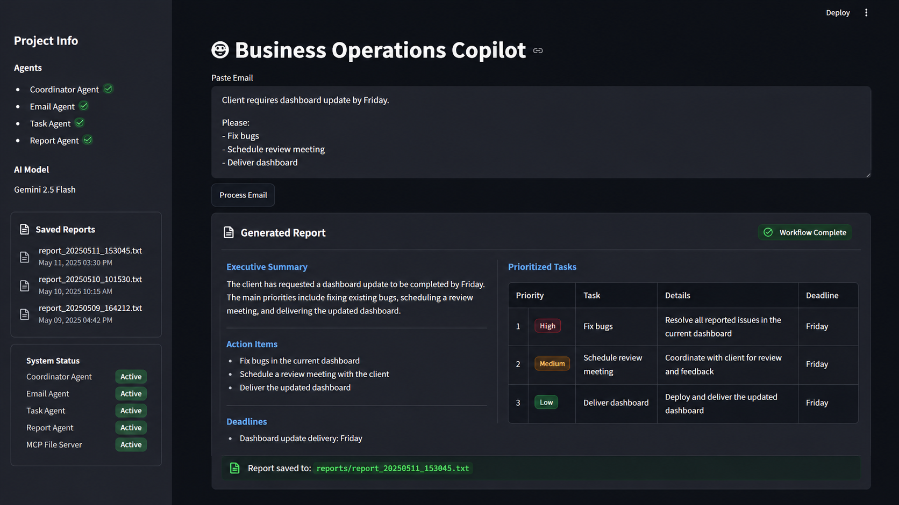

# Business Operations Multi-Agent Copilot

## Overview

Business Operations Multi-Agent Copilot is an AI-powered system that automates business email processing, task prioritization, and report generation using a multi-agent architecture powered by Gemini AI.

The system helps teams reduce manual effort by automatically extracting action items, identifying deadlines, prioritizing work, and generating professional business reports.

---

## Problem Statement

Business teams spend significant time:

* Reading operational emails
* Extracting action items
* Prioritizing tasks
* Preparing status reports

This project automates the workflow using specialized AI agents.

---

## Architecture


### Workflow

1. User submits a business email through Streamlit.
2. Coordinator Agent orchestrates the workflow.
3. Email Agent extracts:

   * Summary
   * Action Items
   * Deadlines
4. Task Agent prioritizes tasks.
5. Report Agent generates a business report.
6. Reports are stored using File Tools.
7. MCP Server exposes report-access tools.

---

## Features

* Multi-Agent Workflow
* Gemini 2.5 Flash Integration
* Structured JSON Agent Communication
* MCP Server Integration
* Report Persistence
* Streamlit User Interface
* Role-Based Security Controls

---

## Technology Stack

* Python
* Google Gemini 2.5 Flash
* Streamlit
* MCP (Model Context Protocol)
* Git & GitHub

---

## Screenshots

### Home Screen


### Generated Report



---

## Project Structure

```text
agents/
tools/
security/
mcp_server/
reports/
docs/
screenshots/

app.py
config.py
requirements.txt
README.md
```

---

## Installation

```bash
git clone <repository-url>
cd business-operations-multi-agent

pip install -r requirements.txt
```

---

## Run Application

```bash
streamlit run app.py
```

---

## Future Enhancements

* Real-time dashboard monitoring
* Additional MCP tools
* Multi-user authentication
* Cloud deployment
* Business analytics dashboard